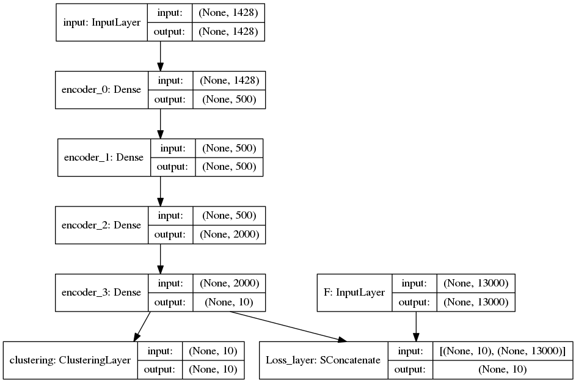

# Semi-supervised deep embedded clustering (SDEC)

Keras implementation for our paper:

* Ren Y, Hu K, Dai X, et al. [Semi-supervised deep embedded clustering](https://www.sciencedirect.com/science/article/pii/S0925231218312049)[J]. Neurocomputing, 2019, 325: 121-130.

## Usage
1. Install [Keras v2.0](https://github.com/fchollet/keras), scikit-learn and git   
`sudo pip install keras scikit-learn`   
`sudo apt-get install git`
2. Clone the code to local.   
`git clone https://github.com/hkrds1996/SDEC.git SDEC`

3. Get pre-trained autoencoder's weights.   
Follow instructions at https://github.com/piiswrong/dec to pre-train the autoencoder.
Then save the trained weights to a keras model (e.g. mnist_ae_weights.h5) and put it in folder 'ae_weights'.  
If you do not want to install Caffe package, you can download the pretrained weights from   
https://github.com/hkrds1996/data_weights   
The put the ae_weights file to the dir of SDEC

4. Run experiment on MNIST.   
`python SDEC.py mnist`
`python IDEC.py mnist`
or
`python DEC.py mnist`

The SDEC (DEC or iDEC) model is saved to "results/sdec_dataset:datasetgamma:number/SDEC_model_final.h5" ("results/dec_dataset:dataset/DEC_model_final.h5" or "results/idec_dataset:datasetgamma:number/IDEC_model_final.h5").

6. Run experiment on USPS, STL, or CIFAR_10.   
`python SDEC.py datasetname`   
`python IDEC.py datasetname`   
or
`python DEC.py datasetname` 

## Models
The SDEC model:    

The IDEC model:    

The DEC model:    

